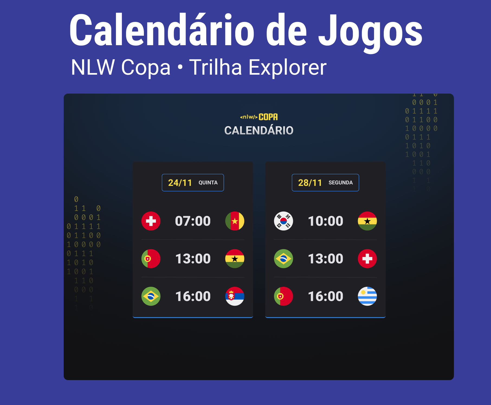

<h1 align="center"> NLW - Copa </h1>

Free and exclusive envent, promoted by Rocketseat to teach WEB techonologies

  <a href="#-tecnologias">Technologies</a>&nbsp;&nbsp;&nbsp;|&nbsp;&nbsp;&nbsp;
  <a href="#-projeto">Project</a>&nbsp;&nbsp;&nbsp;|&nbsp;&nbsp;&nbsp;
  <a href="#-layout">Layout</a>&nbsp;&nbsp;&nbsp;|&nbsp;&nbsp;&nbsp;
  <a href="#memo-licença">License</a>

  

 

  

## 🚀 Technologies

These project was developd with the following thecnologies:

- HTML and CSS
- JavaScript
- Git and Github

## 💻 Project

The World cup calendar is a project to recreat the World Cup game schedule and keep track of the games. You can check the project [HERE](https://bpcampos.github.io/nlw-copa/)

## 🔖 Layout

You can check the project layout [IN HERE](<https://www.figma.com/file/pKnzatwwoiMdzKt1XQenhl/Calend%C3%A1rio-de-Jogos-(Community)?node-id=0%3A1>). It is needed to have a figma account [Figma](https://figma.com) to access it.

## :memo: License

This project is under MIT Lincese.
